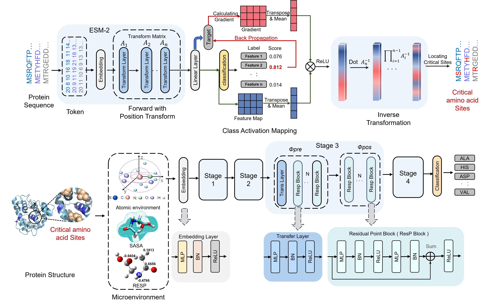

# CASPE

## Overview

The relationship between protein sequence and its properties remains unknown.We developed CASPE (Critical Amino acids Streamline Protein Evolution), a platform adopting Grad-CAM for interpretability and Point Cloud for efficiency, to identify critical residues related to protein properties.



## Installation

### Environment Setup

**Option 1: Using conda (Recommended)**

```bash
# Create and activate environment
conda env create -f CASPE.yaml
```

Option 2：Or you can download the environment tar (CASPE_env.tar.gz) and create the environment manually. (https://zenodo.org/api/records/17851145)

```
cd /anaconda3/envs
mkdir CASPE
tar -xzvf CASPE_env.tar.gz -C /anaconda3/envs/CASPE
```

```### Download Pre-trained Models

You can download the pre-trained models from the following links:

```bash

```
### Dependencies

Core requirements:

* Python 3.10
* PyTorch 2.4.1
* Biopython
* [Other specific bioinformatics libraries]

### Using Pre-trained Models

## Quick Start

### For locating critical residues

bash

CASPE can locate the critical amino acid sites in a protein sequence that are most relevant to thermostability or pH tolerance. When you use this function, you need to download the corresponding models and adjust the parameters in the code according to different requirements at the same time. CASPETs are for locating the critical residues about thermostability and CASPEA is for pH tolerance.

```
python run_get_site.py -c resources/checkpoint -m CASPET -n 5 -i resources/dataset/data_for_CAS/locate.txt -o output/test_CAS_value.json 
```
#### **Checkpoints based on CAS**


| Model                             | Description                                  | Download Link                           |
| --------------------------------- | -------------------------------------------- | --------------------------------------- |
| CASPET_model_1                    | Model related to thermostability (dataset1)  | https://zenodo.org/api/records/17851145 |
| CASPET_model_2<br />(Recommended) | Model related to thermostability (dataset2) | https://zenodo.org/api/records/17851145 |
| CASPET_model_3                    | Model related to thermostability (dataset3) | https://zenodo.org/api/records/17851145 |
| CASPET_model_4                    | Model related to thermostability (dataset4) | https://zenodo.org/api/records/17851145 |
| CASPEA_model                      | Model related to pH tolerance                | https://zenodo.org/api/records/17851145 |

### Predict the most suitable amino acids

You can also predict the most suitable amino acids based on the current microenvironment.

Firstly, get the microenvironment, the data_type is 'pred', and you can get the pqr_site_file by locating critical residues or generating according to your knowledge.

The examples (point_cloud_for_test.tar.gz) could be downloaded from https://zenodo.org/api/records/17851145.

```
python run_generate_point_cloud.py -i resources/dataset/data_for_Micro_Env/pred/pqr -j resources/dataset/data_for_Micro_Env/pred/pqr_site.json -o resources/dataset/data_for_APCNet
```
Sencondly, predict the most suitable amino acids based on the current microenvironment. Example (micro_env_for_predict.tar.gz)could be downloaded from https://zenodo.org/api/records/17851145.

```
python run_predict_res.py -c resources/checkpoint -m APCNetT -i resources/dataset/data_for_APCNet/pred -o output/aa_pred.csv
```
#### APCNet models


| Model    | Description                    | Download Link                           |
| -------- | ------------------------------ | --------------------------------------- |
| APCNetTH | APCNet for thermostability     | https://zenodo.org/api/records/17851145 |
| APCNetAC | APCNet for acid-tolerance     | https://zenodo.org/api/records/17851145 |
| APCNetAL | APCNet for alkaline-tolerance | https://zenodo.org/api/records/17851145 |

## Details for use

### Data Preparation for fine-tuning ESM2

We get the target sequences from dataset, and the sequence related to thermostability or pH tolerance (data_CAS_train.tar.gz) could be regarded as the input of ESM2, download the pretrained- model from https://github.com/facebookresearch/esm

### ESM2 fine-tuning for classfication

```
Waiting for update

```
### For locating critical residues

See at Quick Start

### Generate microenvironment

Get pdb files from AlphaFold (https://alphafold.com/), Get the microenvironment, the data_type is 'train/val', and you can get the pqr_site_file by locating critical residues or generating according to your knowledge.

The examples (point_cloud_for_train.tar.gz) could be downloaded from https://zenodo.org/api/records/17851145.

Before generating point cloud, we get pqr file from pdb file by PDB2PQR (https://pdb2pqr.readthedocs.io/en/latest/getting.html)

```
Waiting for update

```
### APCNet Training

After getting the h5 in the last step, we can train APCNet here. The examples (data_for_APCNet.tar.gz) could be downloaded from https://zenodo.org/api/records/17851145.

```
Waiting for update
```
## Citation

If you find the models useful in your research, we ask that you cite the relevant paper:

```
@article{author2025caspe,
  author={},
  title={},
  year={},
  doi={},
  url={},
  journal={}
}
```
## Acknowledgment

* [facebookresearch/esm: Evolutionary Scale Modeling (esm): Pretrained language models for proteins](https://github.com/facebookresearch/esm)
* [ma-xu/pointMLP-pytorch: [ICLR 2022 poster] Official PyTorch implementation of &#34;Rethinking Network Design and Local Geometry in Point Cloud: A Simple Residual MLP Framework&#34;](https://github.com/ma-xu/pointMLP-pytorch)
* [jacobgil/pytorch-grad-cam: Advanced AI Explainability for computer vision. Support for CNNs, Vision Transformers, Classification, Object detection, Segmentation, Image similarity and more.](https://github.com/jacobgil/pytorch-grad-cam)

## License

This project is licensed under the Apache 2.0 License - see the LICENSE  file for details.
